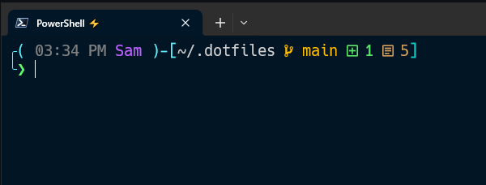

# OhMyPoshTheme.json ⚙️

## Setup
I use [OhMyPosh](https://autohotkey.com/) for my PowerShell Terminal Prompt, once installed the following is added to **$PFOFILE.CurrentUserAllHosts** where **DOTFILES_DIR** is the location of my dotfiles repo on my current local machine.

```
 oh-my-posh init pwsh --config **DOTFILES_DIR** | Invoke-Expression*
```
## Whats Included?
My OhMyPosh Theme includes multiple **segments** which are used to change the overall look of the prompt, these include;

`Current Time`\
`Working Directory`\
`Git Status`\
`Error Notification`

